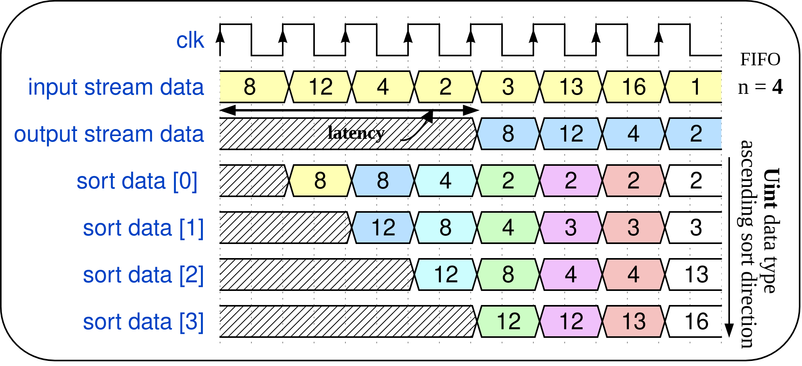
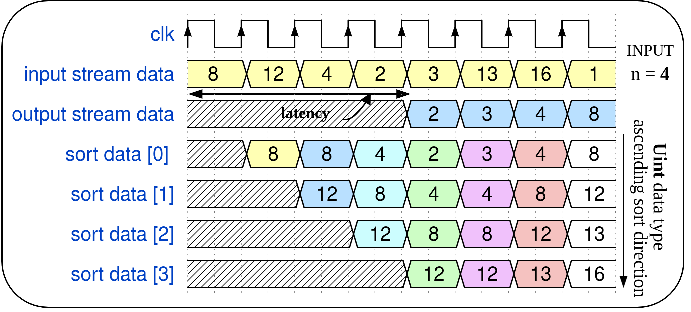

A Linear Insertion Sorter (LIS) Chisel Generator
================================================

## Overview

Fully streaming linear sorters with their rather simple and low-cost hardware architecture are widely used as the fundamental building blocks in many digital signal processing applications that require sorting operations and continuous data streaming interface.

### Linear streaming insertion sorters

Linear insertion sorters use the same principle as the well-known insertion sort algorithm. The incoming data is inserted at the appropriate location inside the sorting array, thus keeping the array sorted at every moment.

The linear insertion sorter is composed of basic processing elements (PEs) connected in a cascade. The sorter generator scheme featuring streaming I/O data and a block diagram of one processing element (PE) for two different linear insertion sorter types is sketched below. The illustrated generator supports, for each sorter type, three subtypes differing only in the decision of which cell should be discarded in the insertion process and sent to the output.

Design generator of linear insertion sorters scheme:

Processing elements of two different LIS types:

Following figures present operating principle of a FIFO-based LIS type that always discards the oldest element in array and operating principle of LIS scheme where discarding element position is defined by the input (e.g. the smallest one).

The Chisel generator is described with following Scala files available inside `src/main/scala` directory:

* `LIS_util.scala` - contains useful objects such as `CounterWithReset` and `LifeCounter`
* `ControlLogic.scala`- description of Control Logic block used inside each `PEcnt` module
* `PEcnt.scala` - description of the basic processing element (PE) for the `LIS_CNT` sorter type
* `PEsr.scala` - description of the basic processing element (PE) for the `LIS_SR` sorter type
* `LinearSorterCNT.scala` -  description of module `LinearSorterCNT`
* `LinearSorterSR.scala` -  description of module `LinearSorterSR`
* `LISNetworkSR.scala` - connects all processing elements `PEcnt`
* `LinearSorter.scala` - contains parameters description and top level modul `LinearSorter`

#### Inputs

[Decoupled](http://github.com/freechipsproject/chisel3/wiki/Interfaces-Bulk-Connections) interface is used where .bits are data that should be sorted.

* `in: Flipped(Decoupled(params.proto))` - input data  wrapped with valid/ready signals
* `lastIn: Input(Bool())` - indicates the last sample in the input stream and triggers data flushing
* Control registers: `sorterSize`, `flushData`, `sortDirection`, `discardPos`

#### Outputs

[Decoupled](http://github.com/freechipsproject/chisel3/wiki/Interfaces-Bulk-Connections) interface is used where .bits are data that should be sent to the streaming output.
* `out: Decoupled(params.proto)` - output streaming data wrapped with valid/ready signals
* `lastOut: Output(Bool())` - indicates the last sample in the output stream
* `sortedData: Output(Vec(params.LISsize, params.proto))` - sorted data
* Status registers: `sorterEmpty`, `sorterFull`

## Parameter settings

Design parameters are defined inside `case class LISParams`. Users can customize design per use case by setting the appropriate parameters.

    case class LISParams[T <: Data: Real](
      proto: T,
      LISsize: Int = 16,
      LIStype: String = "LIS_CNT",
      LISsubType: String = "LIS_FIFO",
      rtcSize: Boolean = false,
      rtcSortDir: Boolean = false,
      discardPos: Option[Int] = None,
      useSorterFull: Boolean = false,
      useSorterEmpty: Boolean = false,
      flushData: Boolean = false,
      sortDir: Boolean = true,
    ) { . . .
    }

The explanation of each parameter is given below:
* `proto:` represents type of the sorted data. Users can choose among the following Chisel types: `UInt`, `SInt`, `FixedPoint`, `DspReal`. Type `DspReal`is used to make golden model of the digital design.
* `LISsize:` is sorter size and it is not limited to be a power of 2
* `LIStype:` used to define linear insertion sorter type
* `LISsubType:` used to define linear insertion sorter subtype
  * Fixed discarding element position scheme - `"fixed"`
  * Fifo based scheme -  `"FIFO"`
  * Input selected discarding element position scheme - `"input"`
* `rtcSize` - used to enable runtime configurable sorter size
* `rtcSortDir` - used to enable runtime configurable sorting direction
* `discardPos` - should be defined only if fixed discarding element scheme is chosen
* `useSorterFull` - enable the corresponding status register
* `useSorterEmpty` - enable the corresponding status register
* `flushData` - include flushing data functionality
* `sortDir` - used to define sorting direction (`true` denotes ascending, `false` denotes descending sorting direction)

## Tests

To run all tests written in Scala simulation environment a user should execute the following command: `testOnly lis.LinearSorterSpec`. Various test cases can be found in `LinearTestersSpec.scala` which is available inside `src/test/scala` directory. Two LIS testers are accessible inside `LinearTesters.scala`:
* `LinearSorterTester` - used for testing design when only compile time configurable parameters are set.
* `LinearSorterTesterRunTime` - used for testing proposed design when run time configurable parameters are included.
* `LinearSorterTLSpec` - simple test with TileLink memory master model

Tester functions such as `peek`, `poke` and `except`, available inside `DspTester` (check [dsptools Chisel library](http://github.com/ucb-bar/dsptools)), are extensively used for design testing.

## Generate Verilog

To generate verilog code for different LIS instances, use or update `generate_verilog.sh` script and `Makefile`. Verilog files for specified instances are then available inside `generated-rtl` directory.

